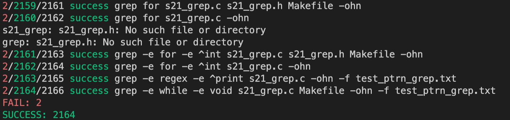

<!--### Hi there 👋-->

<!--
**enikeevtg/enikeevtg** is a ✨ _special_ ✨ repository because its `README.md` (this file) appears on your GitHub profile.

Here are some ideas to get you started:

- 🔭 I’m currently working on ...
- 🌱 I’m currently learning ...
- 👯 I’m looking to collaborate on ...
- 🤔 I’m looking for help with ...
- 💬 Ask me about ...
- 📫 How to reach me: ...
- 😄 Pronouns: ...
- ⚡ Fun fact: ...
-->

### Hey there!
### Tagir Enikeev here
  
### I love coding when it works good

***

***

***
        #include <stdio.h>
        int main(int argc, char** argv) {
          programm body;
          return 0;
        }
***
### Current projects
* __C projects__
* Cpp projects
* DevOps projects
* Algorithms projects
* SQL projects

1. __Simple Bash Utils project__
5. s21_string+ project
8. s21_math project

## SinmpleBashUtils:

|   utils      |  clean code  |  clang-format  |  make (build)  |   make test  |   make leak  |  make valgrind  |  miniverter  |
|--------------|--------------|----------------|----------------|--------------|--------------|-----------------|--------------|
| **s21_cat:** |      ❓      |        ❓       |       ❓       |      ❓      |      ❓       |       ❓        |       ❓     |
| Makefile     |      ❓      |        🙅‍♂️       |                |              |              |                 |              |
| main.c       |      ❓      |        ❓       |                |              |              |                 |              |
| s21_cat.h    |      ❓      |        ❓       |                |              |              |                 |              |
| s21_cat.c    |      ❓      |        ❓       |                |              |              |                 |              |
|              |              |                |                |              |              |                 |              |
| **s21_grep:**  |     ✅     |       ✅       |        ✅       |  ✅ (F=0/S=2165)  |  ✅  (F=100/S=1187)  | ✅  (F=0/S=2474) |   ✅ ✅ ✅   |
| Makefile       |     ✅     |       🙅‍♂️        |                |               |              |                 |              |
| main.c         |     ✅     |       ✅       |                 |              |              |                 |              |
| s21_grep.h     |     ✅     |       ✅       |                 |              |              |                 |              |
| s21_grep.c     |     ✅     |       ✅       |                 |              |              |                 |              |
|                |            |                |                |              |              |                 |              |
| **s21_string** |            |                |                |              |              |                 |              |

## test scripts:

| tests               |  edition | make <target> |    res    |
|---------------------|----------|---------------|-----------|
| test_func_cat       |
| test_leak_cat       |
|                     |
| test_func_grep.sh   |   ✅     |   ✅        | ✅ (FAIL=0/SUCCESS=2165) |
| test_leak_grep.sh   |   ✅     |   ✅        | ✅ (FAIL=100/SUCCESS=1187 (fork: retry: Resource temporarily unavailable)) |
| test_ERROR_VALGRIND |   ✅     |   ✅        | ✅ (FAIL=0/SUCCESS=2474) |

***
> quote 1
>
> quote 1
>
>> quote 2
>>
>> quote 2
>>>
>>> quote 3
>>>
>>> quote 3
>>
>> quote 2
>>
>> quote 2
>
> quote 1
>
> quote 1

***
[regex.h](https://ru.manpages.org/regfree/3 "rus manual for regex.h library")
***
``for (int i = 0; i < argc; i++)``
***
`%>> sh test_func_grep.sh`

***

